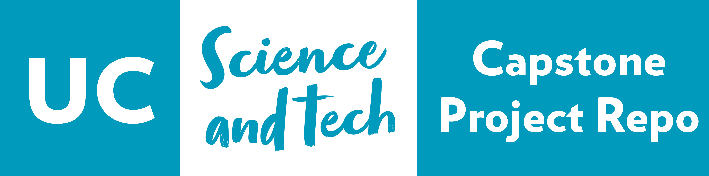

# UC ITS Capstone Project Template

Template repo for UC ITS capstone projects source code.

## Instructions

1. Create a new repo using this [Template Repo](https://github.com/new?template_name=its-capstone-repo-template&template_owner=UC-SciTech)
1. Update the `cs-project.yaml` with your project information
1. Update the `AUTHORS` file with your team members
1. Update the `README.md` file with your project information

## Project Information
